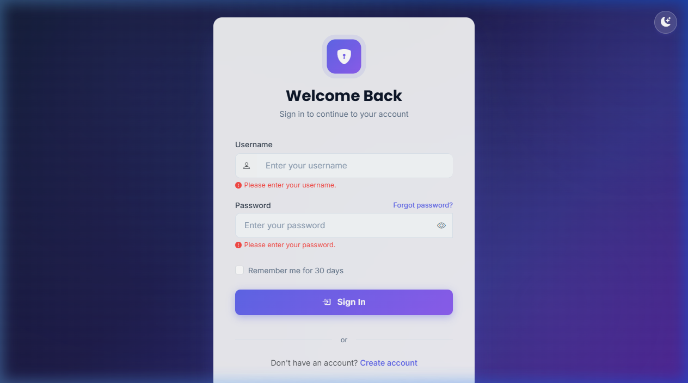
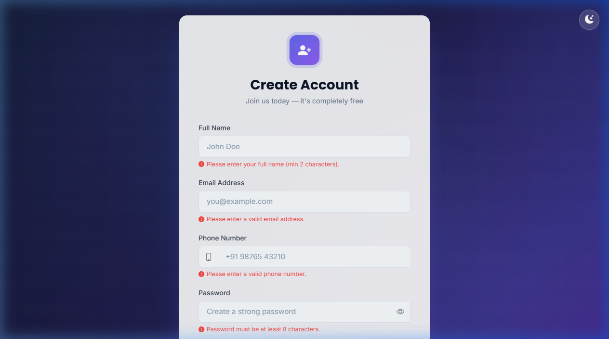
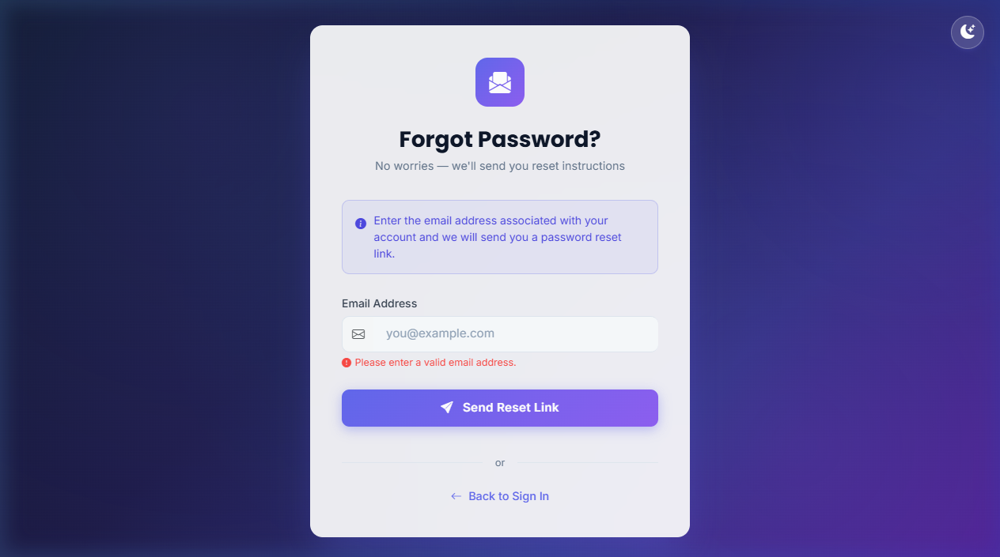
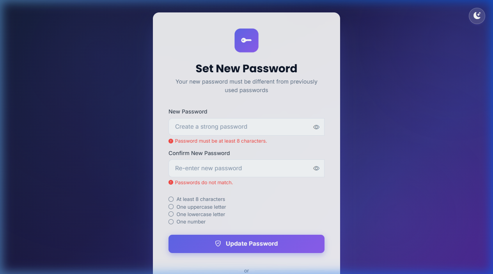
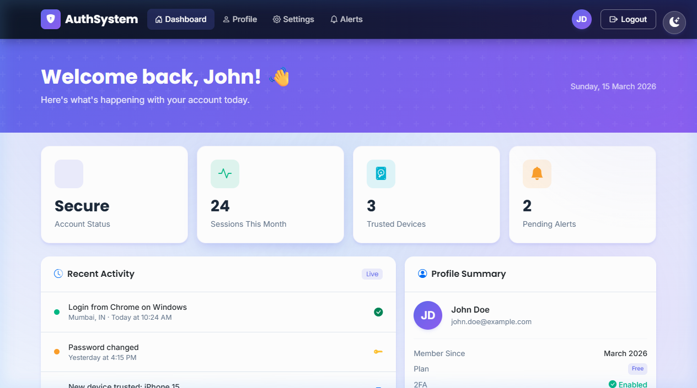

# AuthSystem — Bootstrap 5 Authentication UI

A professional, responsive, and visually stunning authentication system built with **Bootstrap 5**, **Bootstrap Icons**, **custom CSS**, and **Google Fonts**. This project transforms a plain HTML proof-of-concept into a polished, production-ready UI.

---

## 🚀 Pages

| Page | File | Description |
|------|------|-------------|
| Login | `login.html` | Sign-in form with password toggle, remember-me, and loading spinner |
| Register | `register.html` | Registration form with live password strength indicator and validation |
| Forgot Password | `forgot-password.html` | Email submission form with animated success state |
| Reset Password | `reset-password.html` | New password form with strength meter and live requirement checklist |
| Dashboard | `dashboard.html` | Full dashboard with navbar, stat cards, activity feed, and profile summary |

---

## ✨ Features

### Bootstrap 5 Integration
- Bootstrap 5.3 CDN (CSS + JS Bundle)
- Bootstrap Icons 1.11 CDN
- Bootstrap components used: **Cards**, **Navbar**, **Forms**, **Input Groups**, **Badges**, **Buttons**, **Collapse**
- Responsive grid system throughout

### Custom CSS (`styles.css`)
- **Color palette**: Deep Indigo + Violet + Cyan accent
- **Google Fonts**: Inter (body) + Poppins (headings)
- **Animated gradient background** with radial spotlight effects
- **Glassmorphism cards** with `backdrop-filter: blur`
- **Box shadows** with layered depth
- **Hover effects** on all interactive elements
- **Smooth transitions** (`cubic-bezier`) on buttons, cards, and links
- **Dark Mode** persisted via `localStorage`

### Bonus Features Implemented
| Feature | Points |
|---------|--------|
| ✅ Password strength indicator | +5 |
| ✅ Show/Hide password toggle (Bootstrap Icons) | +3 |
| ✅ Form validation with custom error messages | +5 |
| ✅ Loading spinner on button click | +3 |
| ✅ Dark mode toggle | +7 |

---

## 📐 Responsive Breakpoints

| Device | Width |
|--------|-------|
| Mobile | 320px – 767px |
| Tablet | 768px – 1024px |
| Laptop | 1366px – 1920px |
| Desktop | 1920px+ |

---

## 📁 Project Structure

```
html-authentication-poc/
├── login.html              # Login Page
├── register.html           # Registration Page
├── forgot-password.html    # Forgot Password Page
├── reset-password.html     # Reset Password Page
├── dashboard.html          # Dashboard Page
├── styles.css              # Custom CSS (design system)
├── README.md               # This file
└── screenshots/
    ├── login.png
    ├── register.png
    ├── forgot-password.png
    ├── reset-password.png
    └── dashboard.png
```

---

## 📸 Screenshots

### Login Page


### Register Page


### Forgot Password Page


### Reset Password Page


### Dashboard Page


---

## 🛠️ How to Run

1. Clone or download the repository
2. Open `login.html` in any modern browser
3. Navigate through all pages using the links provided

No build step, server, or dependencies required — everything is CDN-based.

---

## 🎨 Design System

| Token | Value |
|-------|-------|
| Primary | `#6366f1` (Indigo-500) |
| Secondary | `#8b5cf6` (Violet-500) |
| Accent | `#06b6d4` (Cyan-500) |
| Font (Body) | Inter |
| Font (Headings) | Poppins |
| Border Radius | `1rem` |
| Transition | `0.3s cubic-bezier(0.4, 0, 0.2, 1)` |

---

## 📚 Resources Used

- [Bootstrap 5 Docs](https://getbootstrap.com/docs/5.3/)
- [Bootstrap Icons](https://icons.getbootstrap.com/)
- [Google Fonts – Inter & Poppins](https://fonts.google.com/)

---

*Submitted for CampusPe Assignment — March 2026*
